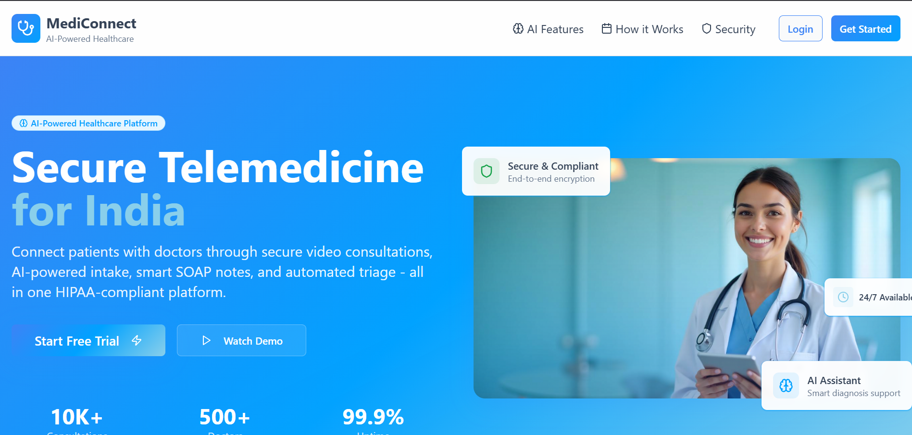
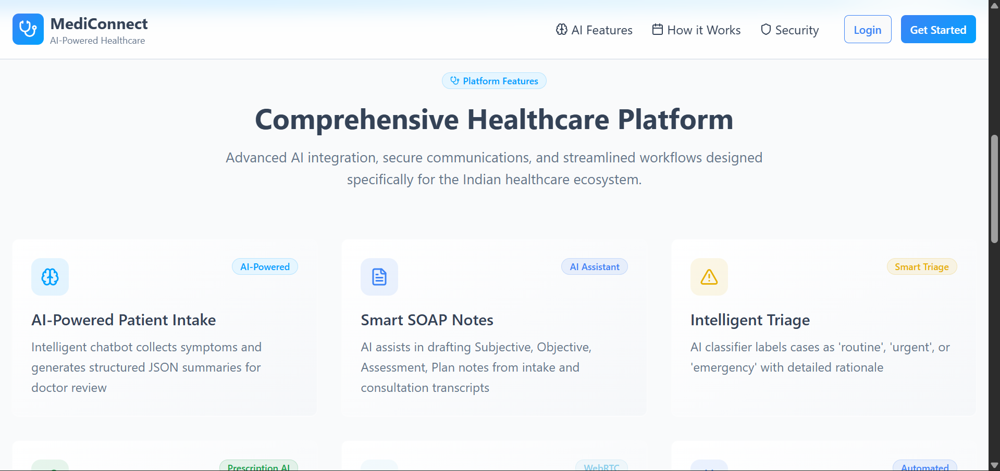
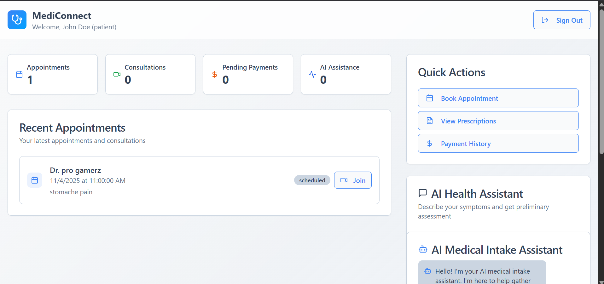
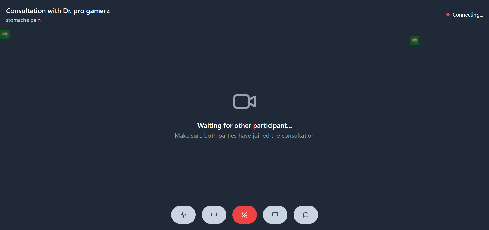
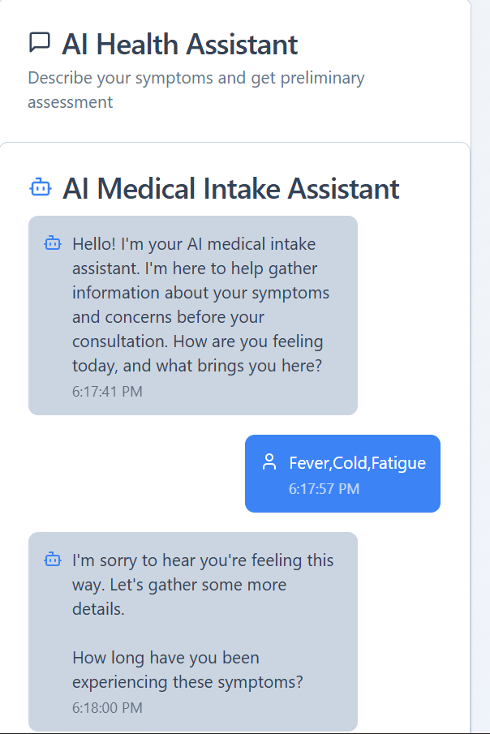
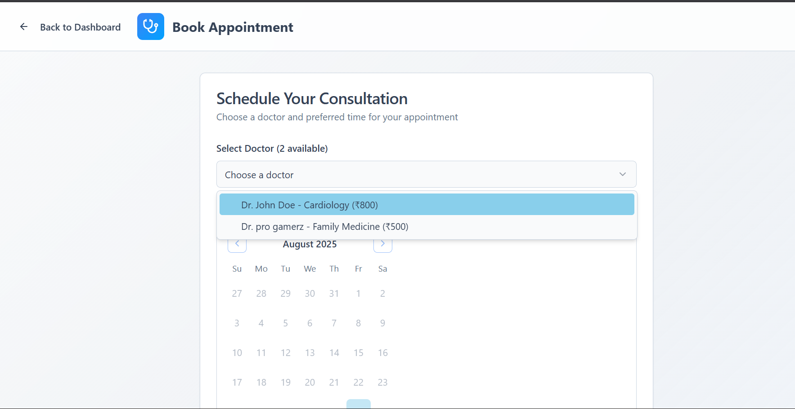
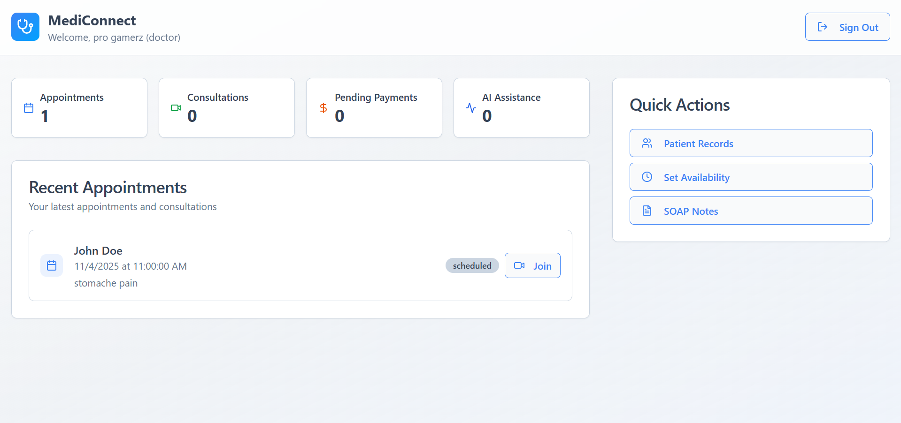

# 🌐 AI Telemedicine Platform  

> 🏥 A modern telemedicine web application built with **React, TypeScript, TailwindCSS, and ShadCN-UI**.  
> 🚀 Designed for scalability, interactivity, and seamless user experience.  

---

## 📸 Preview  

  
  
  
  
  
  
  

---

## 🛠️ Tech Stack  

- ⚡ **Vite** – Lightning-fast build tool  
- ⚛️ **React + TypeScript** – Frontend framework with type safety  
- 🎨 **Tailwind CSS** – Utility-first styling  
- 🧩 **ShadCN-UI** – Beautiful UI components  

---

## ✨ Features  

✔️ Interactive & responsive UI  
✔️ Secure authentication system  
✔️ Real-time communication (future scope)  
✔️ Easy deployment & scaling  
✔️ Customizable design with Tailwind  

---

## ⚙️ Getting Started  

Follow these steps to run the project locally:  

```sh
# 1️⃣ Clone the repository
git clone <YOUR_REPO_URL>

# 2️⃣ Navigate to the project directory
cd <YOUR_PROJECT_NAME>

# 3️⃣ Install dependencies
npm install

# 4️⃣ Start the development server
npm run dev

# 5️⃣ Build for production
npm run build

# 📂 Folder Structure
📦 project-root
├── 📁 src
│   ├── 📁 components   # Reusable UI components
│   ├── 📁 pages        # Page-level components
│   ├── 📁 hooks        # Custom hooks
│   ├── 📁 assets       # Images, icons
│   └── main.tsx        # Entry point
├── package.json
├── tsconfig.json
└── vite.config.ts

🚀 Deployment

Easily deploy on:

🌍 Vercel – vercel --prod
🔥 Netlify – ntl deploy
🟢 Render / Railway / Your custom server
